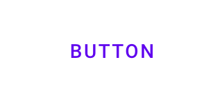
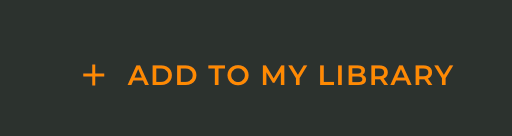
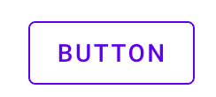
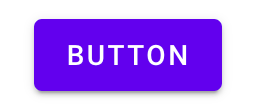
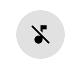

<!--docs:
title: ""
layout: detail
section: components
excerpt: "Web Buttons components article"
iconId:
path: /
api_doc_root:
initial_release:
-->

# Buttons

Buttons allow users to take actions and make choices with a single tap. Buttons can be customized to meet your styles requirements.

For more information, go to the [Buttons](https://material.io/components/buttons/#usage) guidance page.

## Button Variants

* [Text button](#text-button)
* [Outlined button](#outlined-button)
* [Contained button](#contained-button)
* [Toggle button](#toggle-button)

## Using Buttons

### Installation

For text, outlined, and contained buttons, you will need to install `mdc-icon-button` (_This is where a link to a separate API document would come in handy -- both API and dev article are combined for Web._). For toggle buttons, you will need to install `mdc-icon-button` (_This is where a link to the API would also be handy_)

#### `mdc-button`

##### Install `mdc-button`

Install the `mdc-button` component before including it in your source.

```bash
npm install @material/buttons
```

##### Add a theme to `mdc-button`
The `mdc-button` component works with themes (styles). Import a style into your stylesheet to apply it to your website, including buttons:

```css
@import "@material/button/mdc-button";
```
##### Import JavaScript button effects for `mdc-button`
You can also add a JavaScript ripple effect (see [MDC Ripple](https://github.com/material-components/material-components-web/blob/master/packages/mdc-ripple)) to your buttons by importing then instantiating `MCDRipple`. See the page on importing the [JavaScript component](https://github.com/material-components/material-components-web/blob/master/docs/importing-js.md) for more information on importing JavaScript.

```js
import {MDCRipple} from '@material/ripple';

const buttonRipple = new MDCRipple(document.querySelector('.mdc-button'));
```

##### Add an icon to `mdc-button`

Add an icon to your `mdc-button` instance using the following steps:

1. In your HTML file, reference the font library you would like to use (we recommend the [Material Icons](https://material.io/tools/icons/) from Google Fonts):
    ```HTML
    <head>
      <link rel="stylesheet" href="https://fonts.googleapis.com/icon?family=Material+Icons">
    </head>
    ```
1. Include the `mcd-button__icon` class inside your button element. Set the attribute `area-hidden="true"`.
    **Note** The location of the icon element determines if the icon comes before (*leading*) or after (*trailing icon*) the text.


#### `mdc-icon-button`

##### Install `mdc-icon-button`

Install the `mdc-icon-button` component before including it in your source.

```bash
npm install @material/icon-button
```
##### Add a theme to `mdc-button`
The `mdc-icon-button` component works with themes (styles). Import a style into your stylesheet to apply it to your website, including icon buttons:
    ```js
    @import "@material/icon-button/mdc-icon-button";
    ```

##### Import JavaScript button effects for `mdc-button`
You can also add a JavaScript ripple effect (see [MDC Ripple](https://github.com/material-components/material-components-web/blob/master/packages/mdc-ripple)) to your icon buttons by importing then instantiating `MCDRipple`. See the page on importing the [JavaScript component](https://github.com/material-components/material-components-web/blob/master/docs/importing-js.md) for more information on importing JavaScript.

```js
import {MDCRipple} from '@material/ripple';

const iconButtonRipple = new MDCRipple(document.querySelector('.mdc-icon-button'));
iconButtonRipple.unbounded = true;
```
### Add an icon to an `mdc-icon-button` instance

Add an icon to your `mdc-icon-button` instance using the following steps:

1. In your HTML file, reference the font library you would like to use (we recommend the [Material Icons](https://material.io/tools/icons/) from Google Fonts):
    ```HTML
    <head>
      <link rel="stylesheet" href="https://fonts.googleapis.com/icon?family=Material+Icons">
    </head>
    ```
1. Include the `mcd-icon-button__icon` class inside your icon button element.
  You can set the default `pressed` state with the attribute `aria-pressed`. If a toggle button default is `pressed` (`aria-pressed="true"`), you will need to add `mdc-icon-button__icon--on` to the to the class `mdc-icon-button__icon`.

### Text button

Text buttons are typically used for less-pronounced actions, including those located:
* In dialogs
* In cards
In cards, text buttons help maintain an emphasis on card content.

#### Text button example


This example comes from https://glitch.com/~material-theme-builder

##### APIs used

* [mdc-button](https://github.com/material-components/material-components-web/tree/master/packages/mdc-button)
* [mdc-ripple](https://github.com/material-components/material-components-web/blob/master/packages/mdc-ripple)

```html
 <button class="mdc-button">
  <span class="mdc-button__label">BUTTON</span>
</button>
```

#### Text button with icon example


[This example comes from https://glitch.com/~waverly-button]

##### APIs used

* [mdc-button](https://github.com/material-components/material-components-web/tree/master/packages/mdc-button)
* [mdc-ripple](https://github.com/material-components/material-components-web/blob/master/packages/mdc-ripple)


```html
<button class="foo-button mdc-button mdc-button__icon">
      <i class="material-icons mdc-button__icon" aria-hidden="true">add</i>
      ADD TO MY LIBRARY
    </button>
```
[This example comes from https://glitch.com/~waverly-button]

#### Outlined button

Outlined buttons are medium-emphasis buttons. They contain actions that are important, but aren’t the primary action in an app.

##### Outlined button example


This example comes from https://glitch.com/~material-theme-builder

##### APIs used

* [mdc-button](https://github.com/material-components/material-components-web/tree/master/packages/mdc-button)
* [mdc-ripple](https://github.com/material-components/material-components-web/blob/master/packages/mdc-ripple)

```html
<button class="mdc-button mdc-button--outlined">
    Button
</button>
```

#### Contained button

Contained buttons are high-emphasis, distinguished by their use of elevation and fill. They contain actions that are primary to your app.

##### Contained button example


This example comes from https://glitch.com/~material-theme-builder


##### APIs used

* [mdc-button](https://github.com/material-components/material-components-web/tree/master/packages/mdc-button)
* [mdc-ripple](https://github.com/material-components/material-components-web/blob/master/packages/mdc-ripple)

```HTML
<button class="mdc-button mdc-button--raised">
  Button
</button>
```

#### Toggle button
Icon buttons allow users to take actions, and make choices, with a single tap. The icon button can be used to toggle between an on and off icon.

##### Toggle button example with note icon



##### APIs used

* [mdc-icon-button](https://github.com/material-components/material-components-web/tree/master/packages/mdc-icon-button)

```html
<section class="component-section">
    <div class="section-header">
      <a href="https://material.io/design/components/buttons.html#toggle-button" class="mdc-typography--button" target="_blank">
Icon Button
        <i class="material-icons">open_in_new</i>
      </a>
    </div>
    <div class="component-wrapper icon-button-component-wrapper">
      <button id="icon-toggle-button"
      class="mdc-icon-button"
      aria-label="Music off"
      aria-hidden="true"
      aria-pressed="false">
        <i class="material-icons mdc-icon-button__icon mdc-icon-button__icon--on">music_off</i>
        <i class="material-icons mdc-icon-button__icon">music_note</i>
      </button>
    </div>
</section>
```
